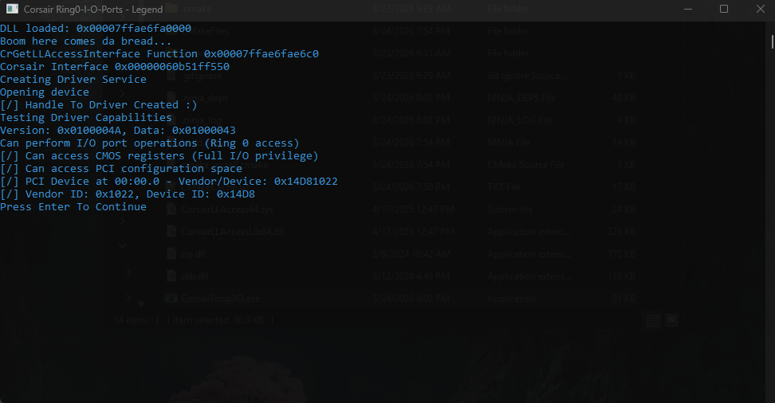

# Corsair-Ring-0-I-O-Ports

# Information
This is not a known exploit nor is it patched yet. CorsairLLAccess64.sys has a function that we can call from either getting the IOCTL code and sending a request, or by looking at the module that handles using this driver and sending a request. Reversing the module will show us that we can load it into our own process, call `CrGetLLAccessInterface` and obtain access to a table that allows us to send requests to the driver.

By loading Corsair's own signed external module (`CorsairLLAccessLib64.dll`) into your process, you can leverage their legitimate, signed driver to gain Ring 0 I/O port read/write access from user mode — no unsigned driver required. Having I/O port R/W at the highest level can allow for some interesting things.

# How To Use
Download the repository, compile the project and place everything from the libs foldering to were the compiled executable is. You can also grab the fresh files from its normal location.
`C:\Program Files\Corsair\Corsair Device Control Service\bin`

# Output Example


# Possibilities
- R/W CMOS RTC
- Control PIC
- Manipulate PIT (Timer)

# CorsairLLAccess64.sys
**Main Dispatch Function**
```
 switch ( LowPart )
    {
      case 0x225398u:
        v11 = sub_140001850;
        break;
      case 0x22539Cu:
        v11 = sub_140001990;
        break;
      case 0x229354u:
LABEL_25:
        v10 = sub_140001FFC((__int64)p_Type, LowPart == 2265940, Options, Length, &a2->IoStatus.Information);// Io Port R/w
        goto LABEL_29;
      case 0x229378u:
        if ( Options >= 8 )
        {
          v10 = sub_140002080((__int64)CurrentStackLocation->FileObject, *p_Type);
          if ( v10 >= 0 )
            *p_Information = 8LL;
          goto LABEL_29;
        }
        goto LABEL_11;
      case 0x229380u:
        v10 = sub_140002120((ULONG *)p_Type, Options, &a2->IoStatus.Information);
        goto LABEL_29;
      default:
LABEL_20:
        v5 = -1073741822;
        goto LABEL_30;
    }
    v10 = sub_140001748((_DWORD)a2, CurrentStackLocation->FileObject, (_DWORD)p_Type, Length, (__int64)v11);
    goto LABEL_29;
```

**IO Port Function**
```
__int64 __fastcall sub_140001FFC(__int64 a1, char a2, unsigned int a3, unsigned int a4, _QWORD *a5)
{
  unsigned int v5; // r8d
  unsigned int v6; // r8d
  unsigned int v7; // r8d
  unsigned int v8; // r8d
  unsigned int v9; // r8d
  unsigned __int32 v11; // eax
  unsigned __int16 v12; // ax
  unsigned __int8 v13; // al

  if ( a3 >= 0xA )
  {
    v5 = *(unsigned __int16 *)(a1 + 8);
    if ( a2 )
    {
      v6 = v5 - 1;
      if ( !v6 )
      {
        __outbyte(*(_DWORD *)a1, *(_BYTE *)(a1 + 4));
        goto LABEL_17;
      }
      v7 = v6 - 1;
      if ( !v7 )
      {
        __outword(*(_DWORD *)a1, *(_WORD *)(a1 + 4));
        goto LABEL_17;
      }
      if ( v7 == 2 )
      {
        __outdword(*(_DWORD *)a1, *(_DWORD *)(a1 + 4));
LABEL_17:
        *a5 = *(unsigned __int16 *)(a1 + 8);
        return 0LL;
      }
      return 3221225485LL;
    }
    if ( a4 >= v5 )
    {
      v8 = v5 - 1;
      if ( !v8 )
      {
        v13 = __inbyte(*(_DWORD *)a1);
        *(_BYTE *)a1 = v13;
        goto LABEL_17;
      }
      v9 = v8 - 1;
      if ( !v9 )
      {
        v12 = __inword(*(_DWORD *)a1);
        *(_WORD *)a1 = v12;
        goto LABEL_17;
      }
      if ( v9 == 2 )
      {
        v11 = __indword(*(_DWORD *)a1);
        *(_DWORD *)a1 = v11;
        goto LABEL_17;
      }
      return 3221225485LL;
    }
  }
  return 3221225507LL;
}
```

# CorsairLLAccessLib64.dll
**16 Bit Write**
```
bool __fastcall sub_18000C040(int a1, unsigned __int16 a2)
{
  DWORD BytesReturned; // [rsp+40h] [rbp-28h] BYREF
  int InBuffer[2]; // [rsp+48h] [rbp-20h] BYREF
  __int16 v5; // [rsp+50h] [rbp-18h]

  if ( hDevice == (HANDLE)-1LL )
  {
    SetLastError(0x139Fu);
    return 0;
  }
  else
  {
    InBuffer[0] = a1;
    InBuffer[1] = a2;
    v5 = 2;
    BytesReturned = 0;
    return DeviceIoControl(hDevice, 0x229354u, InBuffer, 0xAu, 0LL, 0, &BytesReturned, 0LL);
  }
}
```

**32 Bit Write**
```
bool __fastcall sub_18000C180(int a1, int a2)
{
  DWORD BytesReturned; // [rsp+40h] [rbp-28h] BYREF
  int InBuffer[2]; // [rsp+48h] [rbp-20h] BYREF
  __int16 v5; // [rsp+50h] [rbp-18h]

  if ( hDevice == (HANDLE)-1LL )
  {
    SetLastError(0x139Fu);
    return 0;
  }
  else
  {
    InBuffer[0] = a1;
    InBuffer[1] = a2;
    v5 = 4;
    BytesReturned = 0;
    return DeviceIoControl(hDevice, 0x229354u, InBuffer, 0xAu, 0LL, 0, &BytesReturned, 0LL);
  }
}
```

**16 Bit Read**
```
bool __fastcall sub_18000C0E0(int a1, void *lpOutBuffer)
{
  DWORD BytesReturned; // [rsp+40h] [rbp-28h] BYREF
  int InBuffer[2]; // [rsp+48h] [rbp-20h] BYREF
  __int16 v5; // [rsp+50h] [rbp-18h]
  if ( hDevice == (HANDLE)-1LL )
  {
    SetLastError(0x139Fu);
    return 0;
  }
  else
  {
    InBuffer[0] = a1;
    v5 = 2;
    InBuffer[1] = 0;
    BytesReturned = 0;
    return DeviceIoControl(hDevice, 0x225358u, InBuffer, 0xAu, lpOutBuffer, 2u, &BytesReturned, 0LL);
  }
}
```

**32 Bit Read**
```
bool __fastcall sub_18000C220(int a1, void *lpOutBuffer)
{
  DWORD BytesReturned; // [rsp+40h] [rbp-28h] BYREF
  int InBuffer[2]; // [rsp+48h] [rbp-20h] BYREF
  __int16 v5; // [rsp+50h] [rbp-18h]
  if ( hDevice == (HANDLE)-1LL )
  {
    SetLastError(0x139Fu);
    return 0;
  }
  else
  {
    InBuffer[0] = a1;
    v5 = 4;
    InBuffer[1] = 0;
    BytesReturned = 0;
    return DeviceIoControl(hDevice, 0x225358u, InBuffer, 0xAu, lpOutBuffer, 4u, &BytesReturned, 0LL);
  }
}
```
